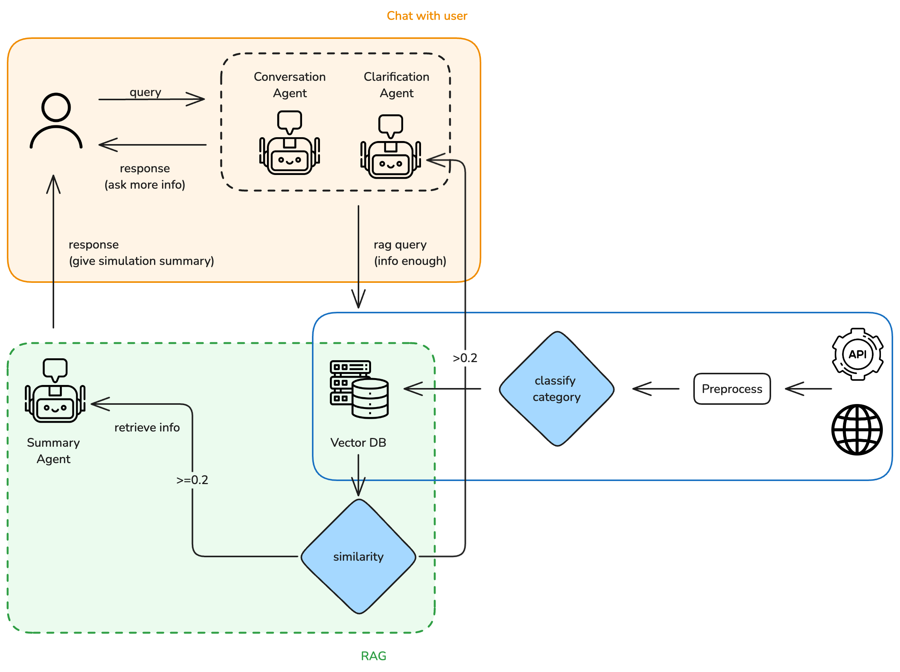

# Guide Agent

An interactive learning assistant system with RAG (Retrieval-Augmented Generation) capabilities.

## System Workflow


## Project Structure
```bash
.
├── Docker-compose.yml
├── README.md
├── backend
│   ├── Dockerfile
│   ├── RAG
│   ├── app.py
│   ├── rag_main.py
│   ├── requirements.txt
│   ├── statics
│   └── util
├── frontend
│   ├── Dockerfile
│   ├── README.md
│   ├── node_modules
│   ├── package.json
│   ├── public
│   └── src
├── requirements.txt
└── statics
  └── chroma_db
```

## Prerequisites
- Docker and Docker Compose installed
- OpenAI API key

## Environment Setup

1. Clone the repository:
```bash
git clone https://github.com/AnnaChen1228/Agentic_AI.git
cd Agentic_AI
```

2. Configure Environment Variables:
 - Open `Docker-compose.yml`
 - Add your OpenAI API key at line 17:
```yaml
environment:
- OPENAI_API_KEY=your_api_key_here
```

## Running the Application

1. Build and start the containers:
```bash
docker compose up --build
```

2. Access the application:
 - Frontend: [http://localhost:2000](http://localhost:2000)
 - Backend API: [http://localhost:4000](http://localhost:4000)